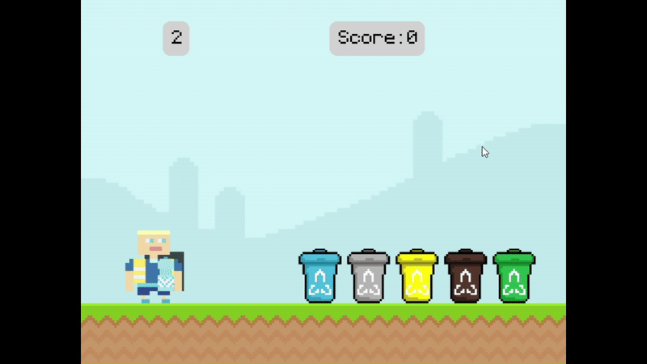

<h1 align="center">🌍 CALL OF EARTH</h1>

  <em>Fun videogame to explore the world of recycling.</em>

  

  
  

## 📚 Table of Contents

- [Overview](#-overview)
  
- [Source Code Download](#️-source-code-download)
  
- [Game Download](#-game-download)
  
- [Gameplay](#-gameplay)
  
- [Credits](#-credits)
 
 

## 🧩 Overview

Call of Earth is a versatile game built with Pygame, designed to deliver engaging eco-themed mini-games and educational content.
Its architecture emphasizes maintainability and seamless integration of multimedia assets.

### Why Call of Earth?

This is a school project that aims to create an interactive platform that promotes environmental awareness through a videogame.

Core features include:

- 🌱 Modular Design: Organized into distinct components for easy extension and maintenance.

- 🎮 Asset Management: Efficient handling of images, audio, and save files for smooth gameplay.

- 🚀 Multi-Game Architecture: Supports diverse mini-games like trash collection, eco-quiz, and vehicle navigation.

- 🛠️ UI & Interaction: Includes menus, achievements, shop, and stats for a comprehensive user experience.

- 🔁 Centralized Control: Manages game flow, stage transitions, and persistent data.
 
 

## ⚙️ Source Code Download
### 🧩 Prerequisites 
The project requires the following dependecies:

- **Programming language:** Python.
  
### 📖 Steps
1. **Clone the repository:**
<pre> > git clone https://github.com/maurotecci/Call_of_Earth_v2 </pre>

2. **Navigate to the project directory:**
<pre> > cd Call_of_Earth_v2 </pre>

3. **Install the dependencies:**
<pre> > pip install -r requirements.txt </pre>

4. **Start main.py:**
<pre> > python src/main.py </pre>
 
 

## 💾 Game Download
1. **Go to the [Releases](../../releases) section** of this repository.
2. **Download** the latest version of `CallOfEarth.exe`.
3. **Unpack** the zip file.
4. **Double-click** the file to start the game. 
 
 

## 🎮 Gameplay
### 🕹️ Controls

| Action                     | Key                         |
|:--------------------------:|:---------------------------:|
| **Aim**                    | Hold **Spacebar**           |
| **Shoot / Move Up**        | ⬆️ **Arrow Up**             |
| **Move Down**              | ⬇️ **Arrow Down**           |
| **Move Left**              | ⬅️ **Arrow Left** or **A**  |
| **Move Right**             | ➡️ **Arrow Right** or **D** |

### 🧰 Game items

| **Textures**             | **Type**                  |
|:--------------------------:|:---------------------------:|
|      | 🗑️ **Trash items** — collect them to earn points |
|  | ⚠️ **Bad items** — avoid them or you'll risk losing |
|  | ⚡ **Boost item** - collect it to bring you closer to victory |

### 📸 Screenshots
🏠 **Main menu**

 

🏀 **Basketball minigame**

<em>Throw the trash in the right bin to score points.</em>

 
 

## 🙌 Credits
Developed by Mauro Tecci — 2024  
Built using Python & Pygame.

[Return ⬆️](#-call-of-earth)

