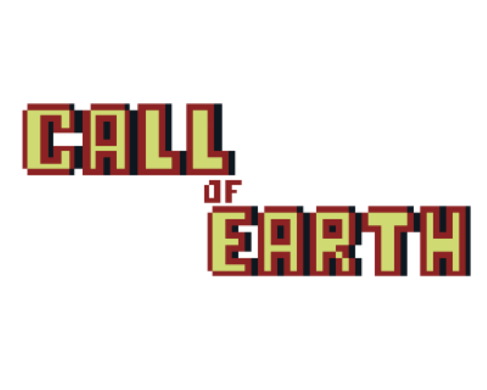
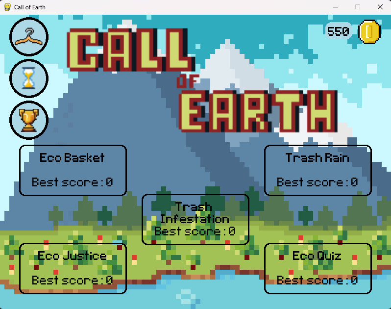
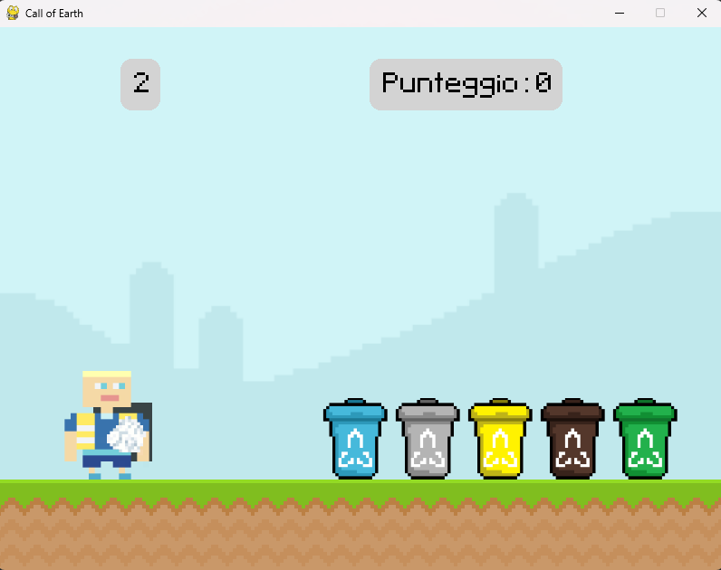

<h1 align="center">🌍 CALL_OF_EARTH_V2</h1>

  <em>Fun videogame to explore the world of recycling</em>

  

  
  
  

## 📚 Table of Contents

- [Overview](#-overview)
  
- [Getting Started](#-getting-started)
  
- [Gameplay](#-gameplay)
  
- [Credits](#-credits)
 
 

## 🧩 Overview

Call_of_Earth_v2 is a versatile game built with Pygame, designed to deliver engaging eco-themed mini-games and educational content.
Its architecture emphasizes maintainability and seamless integration of multimedia assets.

### Why Call_of_Earth_v2?

This is a school project that aims to create an interactive platform that promotes environmental awareness through a videogame.

Core features include:

- 🌱 Modular Design: Organized into distinct components for easy extension and maintenance.

- 🎮 Asset Management: Efficient handling of images, audio, and save files for smooth gameplay.

- 🚀 Multi-Game Architecture: Supports diverse mini-games like trash collection, eco-quiz, and vehicle navigation.

- 🛠️ UI & Interaction: Includes menus, achievements, shop, and stats for a comprehensive user experience.

- 🔁 Centralized Control: Manages game flow, stage transitions, and persistent data.
 
 

## 🚀 Getting Started
### 🧩 Prerequisites
The project requires the following dependecies:

- **Programming language:** Python
  
- **Package manager:** pip
  
### ⚙️ Installation
1. **Clone the repository:**
<pre> > git clone https://github.com/maurotecci/Call_of_Earth_v2 </pre>

2. **Navigate to the project directory:**
<pre> > cd Call_of_Earth_v2 </pre>

3. **Install the dependencies:**
<pre> > pip install -r requirements.txt </pre>

4. **In the src directory start main.py:**
<pre> > python main.py </pre>
 
 

# 🎮 Gameplay   

<em>Main menu: handling which game is chosen</em>

 

<em>Basketball inspired minigame where the objective is to throw the trash in the right bin</em>

 
 

## 🙌 Credits
Developed by Mauro Tecci — 2024  
Built using Python & Pygame.

[Return ⬆️](#-call_of_earth_v2)
